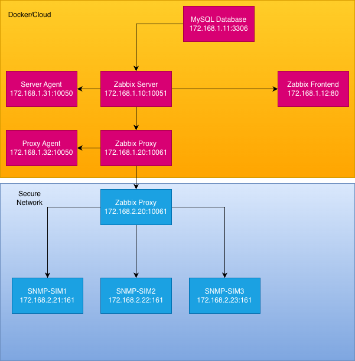

# Zabbix Docker Compose Stack

A complete Zabbix monitoring solution deployed using Docker Compose with separate server and client networks automated with Ansible.

## Components

### Server Services (server-compose.yml)

- **MySQL Server** (`mysql-server`) - MySQL 8.0 database for Zabbix server (172.168.1.11)
- **Zabbix Server** (`zabbix_server`) - Main monitoring server (172.168.1.10)
- **Zabbix Frontend** (`zabbix_frontend`) - Apache-based web interface (172.168.1.12)
- **Zabbix Proxy** (`zabbix_proxy`) - Monitoring proxy with SQLite3 (172.168.1.20 / 172.168.2.10)
- **Zabbix Server Agent** (`zabbix_server_agent`) - Agent for monitoring the Zabbix Server (172.168.1.31)
- **Zabbix Proxy Agent** (`zabbix_proxy_agent`) - Agent for monitoring the Zabbix Proxy (172.168.1.32)

### Client Services (client-compose.yml)

- **SNMP Simulator One** (`snmp-sim1 - SNMP device simulator for Simulated Router #1 (172.168.2.21-23)
- **SNMP Simulator Two** (`snmp-sim2) - SNMP device simulator for Simulated Switch #2 (172.168.2.22)
- **SNMP Simulator Three** (`snmp-sim3) - SNMP device simulator for Simulated Firewall #3 (172.168.2.23)

### Networks

- **docker-cloud** (172.168.1.0/24) - Server-side network (In requirments "Docker/Cloud")
- **secure-network** (172.168.2.0/24) - Client-side network (In requirments "Secure Network")
- **Note:** Zabbix Proxy bridges both networks

### Volumes

- **mysql-data** - Persistent storage for Zabbix server database
- **zabbix-proxy-data** - Persistent storage for Zabbix proxy SQLite database

## Port Mappings

| Service | Host Port | Container Port | Description |
|---------|-----------|----------------|-------------|
| MySQL Server | 3306 | 3306 | Main database access |
| Zabbix Server | 10051 | 10051 | Server trapper port |
| Zabbix Frontend | 80 | 8080 | Web interface (HTTP) |
| Zabbix Proxy | 10061 | 10051 | Proxy trapper port |
| Server Agent | 10050 | 10050 | Server agent port |
| Proxy Agent | 10052 | 10050 | Proxy agent port |
| SNMP Sim 1 | 1161 | 161/udp | SNMP device simulator 1 |
| SNMP Sim 2 | 1162 | 161/udp | SNMP device simulator 2 |
| SNMP Sim 3 | 1163 | 161/udp | SNMP device simulator 3 |

## IP Address Reference

### Docker-Cloud Network (172.168.1.0/24)
```
172.168.1.1   - Gateway
172.168.1.10  - Zabbix Server
172.168.1.11  - MySQL Server
172.168.1.12  - Zabbix Frontend
172.168.1.20  - Zabbix Proxy (server-side)
172.168.1.31  - Zabbix Server Agent
172.168.1.32  - Zabbix Proxy Agent
```

### Secure Network (172.168.2.0/24)
```
172.168.2.1   - Gateway
172.168.2.10  - Zabbix Proxy (client-side)
172.168.2.21  - SNMP Simulator 1
172.168.2.22  - SNMP Simulator 2
172.168.2.23  - SNMP Simulator 3
```

## Quick Start

### 1. Start Server Services

To run the Zabbix instance and Proxy

```bash
cd server
docker compose -f server-compose.yml up -d
```

### 2. Start Client Services

To run SNMP simulators on a separate network:

```bash
cd client
docker compose -f client-compose.yml up -d
```

### 3. Access Zabbix Web Interface

Open your browser and navigate to:
- **HTTP:** http://localhost

### 4. Default Login Credentials

```
Username: Admin
Password: zabbix
```

**Note:** The username has a capital "A".

### 5. Check Service Status

```bash
docker compose -f server-compose.yml ps
docker compose -f client-compose.yml ps
```

### 6. View Logs

```bash
# Server services
docker compose -f server-compose.yml logs -f

# Specific service
docker compose -f server-compose.yml logs -f zabbix_server
docker compose -f server-compose.yml logs -f zabbix_frontend

# Client services
docker compose -f client-compose.yml logs -f snmp-sim1
```

## Configuration

### Network Architecture

This setup uses two separate Docker Compose files with two different networks:

**Server Network (server-compose.yml):**
- Subnet: 172.168.1.0/24
- Contains: MySQL, Zabbix Server, Zabbix Frontend, Zabbix Proxy, Server Agent, Proxy Agent

**Client Network (client-compose.yml):**
- Subnet: 172.168.2.0/24
- Contains: SNMP device simulators for testing SNMP monitoring (As requested per task)

### Database Credentials

Default MySQL credentials (configured in `server-compose.yml`):

```
Root Password: root_password
Database: zabbix
User: zabbix
Password: zabbix_password
```

### Timezone

The frontend is configured for `Latvia/Riga` timezone. To change it, modify the `PHP_TZ` environment variable in the `zabbix_frontend` service.

### Zabbix Proxy Configuration

The proxy uses SQLite3 for its database storage, configured with active mode to connect to the Zabbix server at 172.168.1.10.

### SNMP Simulator Configuration

Three SNMP simulators are configured to test SNMP monitoring:
- **Platform:** Explicitly set to `linux/amd64` for Apple Silicon compatibility
- **SNMPv3 User:** `zabbixUser` with `noAuthNoPriv` security level
- **Data Files:** Each simulator uses a separate `.snmprec` file in the `client/data/` directory

## Configuring Monitoring

### Adding Monitored Hosts and Proxy

An Ansible playbook is provided to automatically configure all hosts in Zabbix:

```bash
# Run the Ansible playbook to deploy all hosts
ansible-playbook site.yml
```

This will automatically:
- Add the Zabbix proxy to the server
- Configure all monitored hosts (agents and SNMP devices)
- Create a Zabbix Proxy
- Apply appropriate templates and settings

## Management Commands

### Stop All Services

```bash
# Stop server services
docker compose -f server-compose.yml down

# Stop client services
docker compose -f client-compose.yml down
```

### Stop and Remove Volumes

```bash
docker compose -f server-compose.yml down -v
```

### Restart Services

```bash
# Restart all server services
docker compose -f server-compose.yml restart

# Restart client services
docker compose -f client-compose.yml restart
```

### Restart Specific Service

```bash
docker compose -f server-compose.yml restart zabbix_server
docker compose -f client-compose.yml restart zabbix_agent_one
```

### Update Images

```bash
# Update server images
docker compose -f server-compose.yml pull
docker compose -f server-compose.yml up -d

# Update client images
docker compose -f client-compose.yml pull
docker compose -f client-compose.yml up -d
```

### Reload Zabbix Configuration

```bash
docker exec zabbix-server zabbix_server -R config_cache_reload
```

### Test Agent Connectivity

```bash
# Test server agent
docker exec zabbix-server zabbix_get -s 172.168.1.31 -k agent.ping

# Test proxy agent
docker exec zabbix-server zabbix_get -s 172.168.1.32 -k agent.ping
```

### Test SNMP Connectivity

```bash
# Test SNMP simulator 1 (from host)
snmpwalk -v3 -u zabbixUser -l noAuthNoPriv -On localhost:1161 system

# Test SNMP simulator from proxy container
docker exec zabbix-proxy snmpwalk -v3 -u zabbixUser -l noAuthNoPriv 172.168.2.21 system
```

## Architecture



## Security Notes

⚠️ **Important:** This configuration uses default passwords suitable for development/testing only.

## Additional Resources

- [Zabbix Documentation](https://www.zabbix.com/documentation/current)
- [Zabbix Docker Images](https://hub.docker.com/u/zabbix)
- [Zabbix Create Hosts](https://docs.ansible.com/projects/ansible/latest/collections/community/zabbix/index.html)
